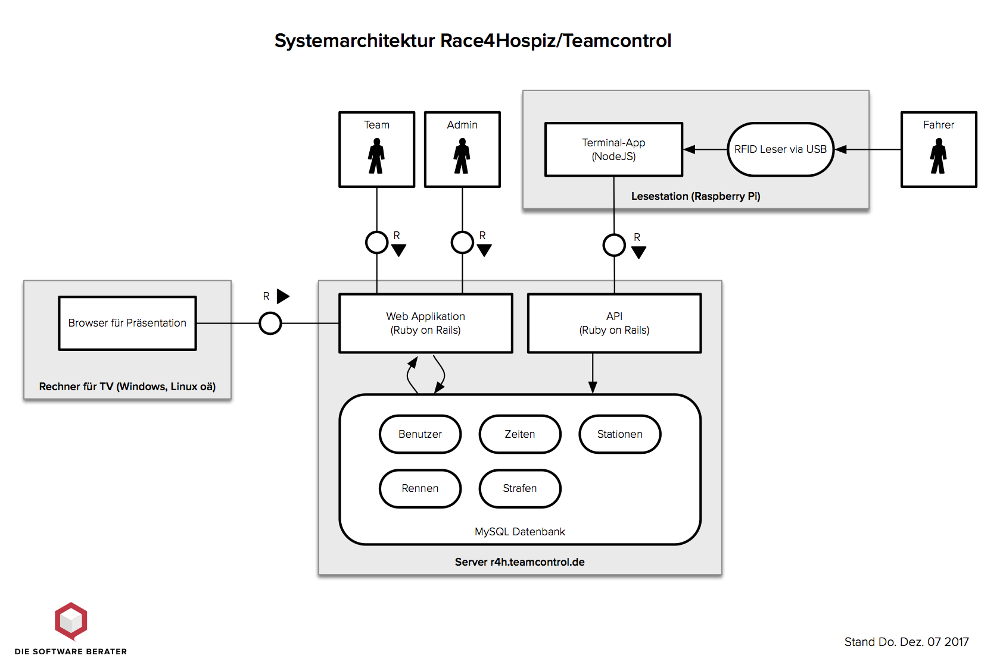

# TeamControl Rennsoftware

Kartrennen wie das jährliche [race4hospiz](http://race4hospiz.de) Rennen bestehen aus einer Anzahl von Teams, die gegeneinander antreten, um in einer vorgegebenen Gesamtzeit möglichst viele Runden zu fahren. Jedes Team besteht dabei aus einer Anzahl von Fahrern (5-8 Fahrer pro Team). Die Fahrer wechseln sich ab. Es muss überwacht werden, dass

* Fahrer nicht länger als vorgeschrieben am Stück fahren
* Fahrer zwischen den Fahrten eine Mindestmenge Pause einlegen
* der Wechsel von einem Fahrer zum nächsten nicht länger dauert als 1-3 Minuten

Die TeamControl Software unterstützt das durch folgende Funktionen:

* Organisation der Teams
* Protokollierung der Fahrerwechsel
* Bereitstellen von sekundengenauen Anzeigen für Teams und Rennleitung

## API Dokumentation
Die Dokumentation findet sich [hier](doc/docs.md)

## Aufbau

TeamControl besteht aus **einem Server** und **optionalen Lesestationen**. Die Software der Lesestationen findet sich [auf Github](https://github.com/Race4Hospiz/teamcontrol-reader).

## Ablauf eines Rennens

1. Definition der Stammdaten eines Rennens: Dauer, max. Fahrzeiten ua.
2. Definition der Teams
   * Zuweisung der Fahrer zu den Teams
3. Registrieren der NFC Tags für die Fahrer
4. Start des Rennens
   * Fahrer erzeugen kommen/gehen Buchungen je nach Konfiguration
   * laufende Auswertung über alle Teams und in der individuellen Teamansicht
5. Ende des Rennens
   * Abschluss aller uU nicht abgeschlossenen Fahrerdaten
   
Im laufenden Betrieb kann es dabei zu besonderen Aktionen kommen. Diese sind:

* manuelle Buchung vergessener kommen/gehen Daten durch die Rennleitung
* Erfassung von Ersatz-Tags für Fahrer

## Registrierungsschema

Wir verwenden die technische ID auf jedem NFC Tag zur Registrierung und Identifikation eines Fahrers. Die Lesestation überträgt die ID der gelesenen Karte, der Server antwortet darauf wie folgt:

Ist die übertragene ID *unbekannt*

- registriert der Server diese **für die erste (älteste) Fahrerzuordnung** und antwortet mit einer **Erfolgsmeldung**, die den Namen des Fahrers beinhaltet
- bzw antwortet mit einer **Fehlermeldung** wenn keine Fahrerzuordnung ohne ID zu finden ist

Ist die übertragene ID bekannt, dh existiert eine Fahrerzuordnung für diese ID, dann

- im **kommend/gehend** Modus
  - legt der Server eine **kommend** Buchung an, wenn der registrierte Fahrer nicht gleich dem aktuellen Fahrer ist
  - legt der Server einen **gehend** Buchung an, wenn der registrierte Fahrer gleich dem aktuellen Fahrer ist, und erzeugt einen Fahrzeiteintrag für diesen Fahrer. Dessen Dauer wird bestimmt vom Zeitpunkt der letzten kommend-Buchung des gleichen Fahrers, frühestens dem Beginn des Rennens.
  - und antwortet mit einer **Erfolgsmeldung**
- im **gehend** Modus
  - legt der Server eine **gehend** Buchung an, und erzeugt einen Fahrzeiteintrag für diesen Fahrer. Dessen Dauer wird bestimmt vom Zeitpunkt der letzten gehend-Buchung des gleichen Teams, alternativ dem Beginn des Rennens.
  - und antwortet mit einer **Erfolgsmeldung**

Mehrfache Übermittlungen derselben ID innerhalb eines kurzen Zeitraumes (zB 15 Sekunden) werden ignoriert, nur der erste Scan wird bearbeitet.

## Entitäten

* **Rennen** `race`  
  Stammdaten zum Rennen
* **Team** `team`  
  Name und Logo des Teams, gehört zum Rennen
* **Fahrer** `driver`  
  Name des Fahrers
* **Teilnahme** `attendance`  
  Gehört zu Team & Fahrer, beinhaltet die NFC ID des Fahrers in diesem Rennen
* **Ereignis** `event`  
  Gehört zu Team & Fahrer, beinhaltet kommen/gehen Buchungen und Registrierungen mit einem Zeitstempel
* **Fahrzeit** `turn`  
  Gehört zu Team & Fahrer, beinhaltet die Dauer des Einsatzes
  
## Auswertung

- Aktueller Fahrer pro Team (nur im kommend/gehend Modus)
- Letzter Fahrer pro Team
- Fahrzeit pro Fahrer: Summe aller Fahrzeiten
- Fahrzeiten pro Team: Summe aller Fahrzeiten aller Fahrer dieses Teams
